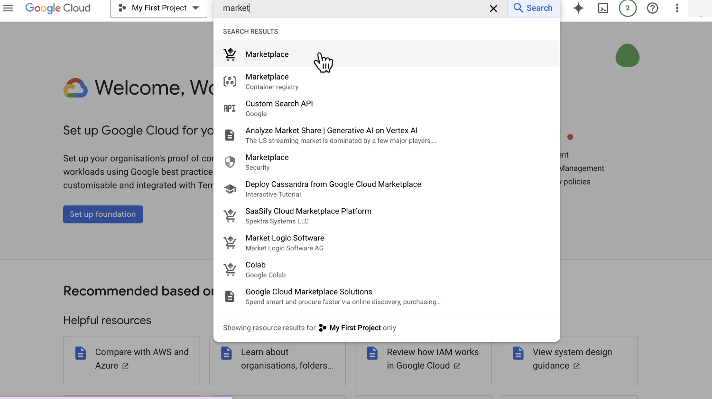
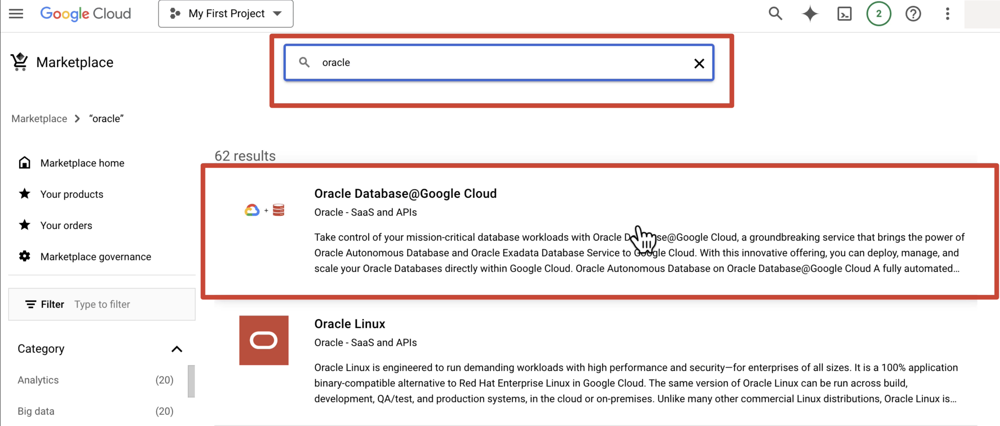
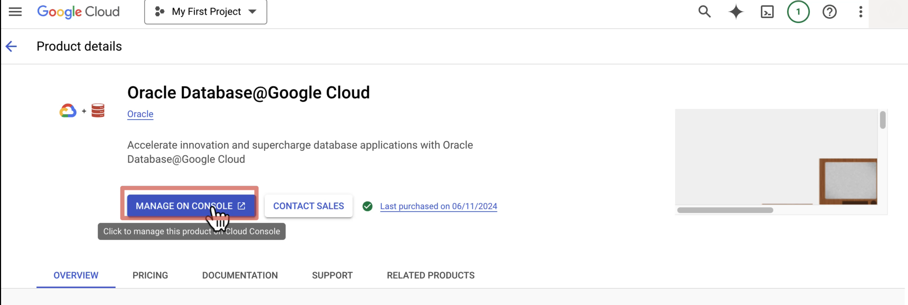
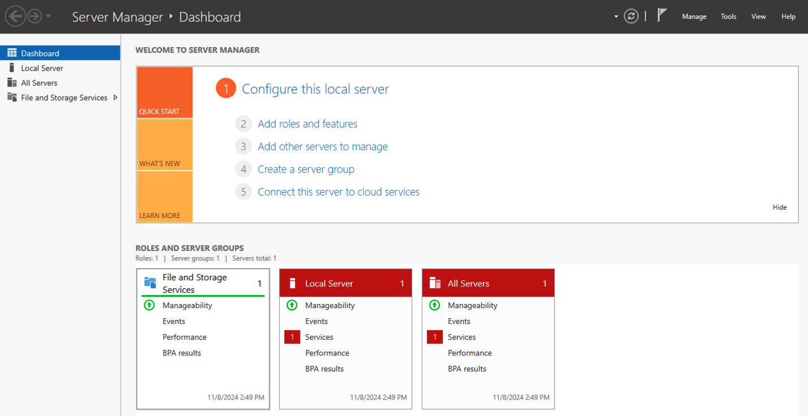
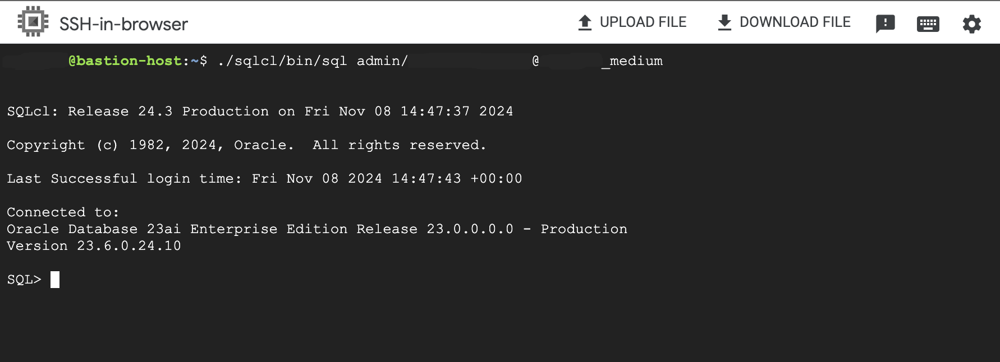

# Deploying Oracle Database on Google Cloud Platform (GCP)

One of the key benefits of using GCP is its ability to support a wide range of databases, including Oracle. In this blog post, we'll focus on deploying an Autonomous Database on Google Cloud Platform (GCP). An Autonomous Database is a self-managing database that automatically handles maintenance tasks, freeing up your time to focus on higher-level tasks.

 We will cover the following topics:

- Creating a virtual private cloud (VPC) network
- Creating subnets and firewall rules
- Creating a bastion host or a Windows VM for easy APEX development
- Deploying an Oracle Autonomous Database
- Configuring instaclient and sqlcl for Oracle Autonomous Database

## Prerequisites

Before we begin, make sure you have the following prerequisites:

- A GCP account with the necessary permissions to create resources
- A Bash shell installed on your system
- The gcloud command-line tool installed and configured on your system
- Oracle Autonomous Database at Google Cloud Platform(GCP) marketplace image


## How to

### Subscribe to Oracle Autonomous Database on GCP

The first step in deploying an Oracle Autonomous Database on GCP is to subscribe to Oracle Database@Google Cloud image.

- Click search bar and type  `marketplace`
 

- In search bar type `oracle`
  

- Click on `subscribe`
  

- Once Image is activated click on `Manage on OCI`
  

- Connect Marketplace offer with an Oracle Account and click on `Create Account`
  

Once your account is approved you can deploy Oracle Autonomous Database on GCP.  

### Deploy Oracle Autonomous Database on GCP

To automate the deployment process, we've created a Bash script that guides you through each step. The script is divided into several smaller scripts stored in the deploy/scripts directory, making it easier to manage and maintain individual components.

Here's an overview of the automation script:

```bash
#!/bin/bash

# Define steps
steps=(
  "Load configuration" "./scripts/config_loader.sh"
  "Ask for database name" "./scripts/ask_for_database_name.sh"
  "Create VPC" "./scripts/create_vpc.sh"
  "Create subnets" "./scripts/create_subnets.sh"
  "Create firewall rules" "./scripts/create_firewall_rules.sh"
  "Create Windows VM" "./scripts/create_windows_vm.sh"
  "Create Ubuntu Web Server" "./scripts/create_ubuntu_web_server.sh"
  "Create database" "./scripts/create_database.sh"
)

for ((i=0; i<${#steps[@]}; i+=2)); do
  echo ""
  echo "-------------------------"
  echo "|  Select Deployment Steps  |"
  echo "-------------------------"
  echo ""
  echo "Do you want to ${steps[i]}? (y/n)"
  read answer
  if [ "$answer" == "y" ]; then
    ${steps[i+1]}
  else
    echo "Skipping ${steps[i]}..."
  fi
done
```

### Step-by-Step Guide

Let's walk through each step in detail:

#### Load Configuration

The first step loads the configuration from a JSON file using the `config_loader.sh` script.

  `./scripts/config_loader.sh`

```JSON
{
  "project_id": "",
  "region": "",
  "vpc_name": "",
  "public_subnet": "",
  "private_subnet": "",
  "ingress_rule": "",
  "egress_rule": "",
  "bastion_name": "",
  "admin_password": "",
  "web_server_name": "",
  "database_name": "",
  "database_display_name": ""
}
```

#### Ask for Database Name
The next step asks the user for the database name using the `ask_for_database_name.sh` script.

  `./scripts/ask_for_database_name.sh`

```bash
# Ask user for database name
read -p "Enter the database name (letters only): " DATABASE_NAME

while [[ $DATABASE_NAME =~ [^a-zA-Z] ]]; do
  echo "Invalid input. Please enter a database name containing only letters."
  read -p "Enter the database name (letters only): " DATABASE_NAME
done

DATABASE_DISPLAY_NAME=$DATABASE_NAME
```

#### Create a VPC Network

This step creates a VPC using the `create_vpc.sh` script.

  `./scripts/create_vpc.sh`

```bash
# Create VPC
log_message "Creating VPC..."
VPC_ID=$(gcloud compute networks create $VPC_NAME --subnet-mode=custom --format='get(id)' || { log_message "Failed to create VPC"; exit 1; })
echo "VPC Name: $VPC_NAME" >> $LOG_FILE
echo "VPC ID: $VPC_ID" >> $LOG_FILE
log_message "VPC created successfully."
```

### Create Subnets and Firewall Rules

Next, we need to create subnets and firewall rules for our VPC network.

#### Create Subnets

This step creates subnets using the `create_subnets.sh` script.

The reason for creating two subnets, one for private IP addresses and one for public IP addresses, is to provide network isolation for different types of traffic. Private subnets are used to host internal resources that do not need to be accessible from the internet, while public subnets are used to host resources that require internet access.

By separating these subnets, it becomes easier to control network traffic and ensure that private resources remain secure and isolated from the public network. Additionally, enabling private IP access for Google Cloud instances ensures that they have a unique IP address within the VPC, which is not visible or accessible from the internet.

  `./scripts/create_subnets.sh`

```bash
# Create subnets
log_message "Creating subnets..."
PRIVATE_SUBNET_ID=$(gcloud compute networks subnets create $PRIVATE_SUBNET --network=$VPC_NAME --region=$REGION --range=192.168.5.0/24 --enable-private-ip-google-access --format='get(id)' || { log_message "Failed to create private subnet"; exit 1; })
echo "Private Subnet Name: private-subnet1" >> $LOG_FILE
echo "Private Subnet ID: $PRIVATE_SUBNET_ID" >> $LOG_FILE
PUBLIC_SUBNET_ID=$(gcloud compute networks subnets create $PUBLIC_SUBNET --network=$VPC_NAME --region=$REGION --range=192.168.4.0/24 --enable-flow-logs --enable-private-ip-google-access --format='get(id)' || { log_message "Failed to create public subnet"; exit 1; })
echo "Public Subnet Name: public-subnet1" >> $LOG_FILE
echo "Public Subnet ID: $PUBLIC_SUBNET_ID" >> $LOG_FILE
log_message "Subnets created successfully."
```

#### Create Firewall Rules

The fifth step creates firewall rules using the create_firewall_rules.sh script.

  `./scripts/create_firewall_rules.sh`

Creates two firewall rules: one for incoming traffic (ingress) and another for outgoing traffic (egress). The ingress rule allows SSH, HTTP, HTTPS, Autonomous DB, and RDP access from any source (0.0.0.0/0), while the egress rule allows the same traffic to reach the internet. Both rules are associated with the VPC and have a priority of 1000.

```bash
# Create firewall rules
log_message "Creating firewall rules..."
INGRESS_RULE_ID=$(gcloud compute firewall-rules create $INGRESS_RULE --direction=INGRESS --priority=1000 --network=$VPC_NAME --action=ALLOW --rules=tcp:22,tcp:80,tcp:443,tcp:1522,tcp:3389 --source-ranges=0.0.0.0/0 --description="Allow SSH, HTTP, HTTPS, Autonomous DB, and RDP access" --target-tags=http-server,bastion --format='get(id)' || { log_message "Failed to create ingress firewall rule"; exit 1; })
echo "Ingress Firewall Rule Name: allow-common-ports" >> $LOG_FILE
echo "Ingress Firewall Rule ID: $INGRESS_RULE_ID" >> $LOG_FILE
```  

  The first firewall rule, allow-common-ports, is an ingress rule that allows specific types of traffic from any source (0.0.0.0/0) to reach instances in the VPC. This rule allows SSH, HTTP, HTTPS, Autonomous DB, and RDP access to the VPC. The direction parameter is set to INGRESS, which means that the rule allows traffic coming into the VPC.  

```bash
EGRESS_RULE_ID=$(gcloud compute firewall-rules create $EGRESS_RULE --direction=EGRESS --priority=1000 --network=$VPC_NAME --action=ALLOW --rules=tcp:22,tcp:80,tcp:443,tcp:1522,tcp:3389 --destination-ranges=0.0.0.0/0 --target-tags=http-server,bastion --format='get(id)' || { log_message "Failed to create egress firewall rule"; exit 1; })
echo "Egress Firewall Rule Name: allow-vm-egress" >> $LOG_FILE
echo "Egress Firewall Rule ID: $EGRESS_RULE_ID" >> $LOG_FILE
log_message "Firewall rules created successfully."
```  

  The second firewall rule, allow-vm-egress, is an egress rule that allows specific types of traffic from instances in the VPC to reach the internet. This rule also allows SSH, HTTP, HTTPS, Autonomous DB, and RDP access. The direction parameter is set to EGRESS, which means that the rule allows traffic leaving the VPC.

### Create a Ubuntu and/or Windows VM

Next, I created a webserver host and/or Windows VM.  

#### Create Windows VM

The sixth step creates a Windows VM using the `create_windows_vm.sh` script.

Windows VM is a virtual machine that runs the Windows operating system and can be handy if you want access to Oracle APEX User Interface.

  `./scripts/create_windows_vm.sh`

```bash
log_message "Creating Windows VM..."
WINDOWS_VM_ID=$(gcloud compute instances create quickstart-winvm --image-family windows-2022 --image-project windows-cloud --machine-type e2-standard-4 --zone $REGION-a --network $VPC_NAME --network-tier=PREMIUM --subnet $(gcloud compute networks subnets describe public-subnet1 --region $REGION --format='get(selfLink)') --boot-disk-size 50GB --boot-disk-type pd-ssd --enable-display-device --tags=bastion --format='get(id)' || { log_message "Failed to create Windows VM"; exit 1; })
echo "Windows VM Name: quickstart-winvm" >> $LOG_FILE
echo "Windows VM ID: $WINDOWS_VM_ID" >> $LOG_FILE
log_message "Windows VM created successfully."
```

#### Create Web Server VM

The seventh step creates an Ubuntu web server using the `create_ubuntu_web_server.sh` script.

  `./scripts/create_ubuntu_web_server.sh`

```bash
# Create Ubuntu Web Server
log_message "Creating Ubuntu Web Server..."
UBUNTU_WEB_SERVER_ID=$(gcloud compute instances create $WEB_SERVER --zone=$REGION-a --machine-type=e2-medium --subnet=$PUBLIC_SUBNET --network-tier=PREMIUM --maintenance-policy=MIGRATE --image-family=ubuntu-2004-lts --image-project=ubuntu-os-cloud --boot-disk-size=10GB --boot-disk-type=pd-balanced --boot-disk-device-name=ubuntu-web-server --no-shielded-secure-boot --shielded-vtpm --tags=http-server,bastion --format='get(id)' || { log_message "Failed to create Ubuntu Web Server"; exit 1; })
echo "Ubuntu Web Server Name: ubuntu-web-server" >> $LOG_FILE
echo "Ubuntu Web Server ID: $UBUNTU_WEB_SERVER_ID" >> $LOG_FILE
log_message "Ubuntu Web Server created successfully."
```

### Create Oracle Database@Google Cloud

The final step creates the Oracle Autonomous Database using the `create_database.sh` script.

```bash
# Create database
log_message "Creating database..."
DATABASE_ID=$(gcloud oracle-database autonomous-databases create $DATABASE_DISPLAY_NAME --location=$REGION --display-name=$DATABASE_DISPLAY_NAME --database=$DATABASE_NAME --network=$VPC_NAME --cidr=192.168.0.0/24 --admin-password=$ADMIN_PASSWORD --properties-compute-count=2 --properties-data-storage-size-gb=500 --properties-db-version=23ai --properties-license-type=LICENSE_INCLUDED --properties-db-workload=OLTP --format='get(id)' || { log_message "Failed to create database"; exit 1; })
echo "Database Name: $DATABASE_DISPLAY_NAME" >> $LOG_FILE
echo "Database ID: $DATABASE_ID" >> $LOG_FILE
log_message "Database created successfully."
```

Here is breakdown of the command

- `--location`: select the region where you want database. Please mind here that this services is not availbie in all regions  
  
- `--display-name`: provide a name for your Oracle Autonomous Database  
  
- `--database`: provide a unique name for your Oracle Autonomous Database  
  
- `--network`: select the VPC network ID where you want to run your Oracle Autonomous Database
  
- `--cidr`: select the CIDR block for your subnet where you want to run your Oracle Autonomous Database  
  
- `--admin-password`: provide a strong password for the administrator account of your Oracle Autonomous Database  
  
- `--properties-compute-count=`: specify the number of compute resources to allocate for your Oracle Autonomous Database  
  
- `--properties-data-storage-size-gb`: specify the amount of data storage to allocate for your Oracle Autonomous Database  
  
- `--properties-db-version`: specify the version of Oracle Autonomous Database you want to use
  
- `--properties-license-type`: specify the license type for your Oracle Autonomous Database  
  
- `--properties-db-workload`: specify the workload type for your database (in this example, we are using OLTP)

### Connect to Oracle Database@Google Cloud

#### Connect to Oracle Database@Google Cloud APEX UI via Windows VM

- In `Compute Engine` section under `VM instances` you can access Windows VM.

  

- Click on `RDP` to download remote desktop file.  

- Open remote desktop file and login with your windows password.  

  

- Once logged in open browser on your remote `Windows VM` and navigate to Private endpoint URL

  

Then choose Oracle APEX

  

- Login with your admin password and create new `workspace`.

  

- Login to your `workspace`.

  

  

#### Connect to Oracle Database@Google Cloud via sqlcl running

- SSH to your VM

- Download and install [Oracle Instant Client](https://www.oracle.com/uk/database/technologies/instant-client/linux-x86-64-downloads.html)

```bash
wget https://download.oracle.com/otn_software/linux/instantclient/instantclient-basic-linux.x64-23.4.0.24.05.zip
sudo apt install zip
unzip instantclient-basic-linux.x64-23.4.0.24.05.zip
```

- Set the following environment variables to point to the extracted directory:

```bash
export ORACLE_HOME=/path/to/instantclient_23_4
export LD_LIBRARY_PATH=$ORACLE_HOME:$LD_LIBRARY_PATH
export PATH=$ORACLE_HOME:$PATH
```

Replace `/path/to/instantclient_23_4` with the actual path where you extracted the archive.

- Upload your wallet to the VM

  

- Unzip wallet by running

```bash
mkdir Wallet
unzip <YOUR WALLET NAME>.zip
```

- Export path to your wallet to TNS_ADMIN  

```bash
export TNS_ADMIN=<PATH TO UNZIPPED WALLET>
```

Replace `<PATH TO WALLET>` with the actual path where you extracted wallet zip.

- Install required packages

```bash
sudo apt-get install default-jdk libaio1 libaio-dev
```

- Download SQLCL - [here is official download page for SQLCL](https://www.oracle.com/database/sqldeveloper/technologies/sqlcl/download/)-

```bash
wget https://download.oracle.com/otn_software/java/sqldeveloper/sqlcl-latest.zip
```

- Unzip SQLCL

```bash
unzip sqlcl-24.3.0.285.0530.zip 
```

- Run SQLCL to connect to the Oracle Autonomous Database

```bash
./sqlcl/bin/sql admin/password@tnsname_medium
```

  

```sql
-- Create a table with a JSON column
CREATE TABLE mytable (
    id NUMBER PRIMARY KEY,
    data VARCHAR2(4000) CHECK (data IS JSON)
);

-- Insert some sample data
INSERT INTO mytable (id, data) VALUES (1, '{"name":"John", "age":30}');
INSERT INTO mytable (id, data) VALUES (2, '{"name":"Jane", "age":25}');

-- Query the JSON data using SQL/JSON functions
SELECT * FROM mytable WHERE JSON_VALUE(data, '$.name') = 'John';

-- Update the JSON data using JSON_OBJECT function
UPDATE mytable 
SET data = JSON_OBJECT('name' VALUE JSON_VALUE(data, '$.name'), 'age' VALUE 31) 
WHERE JSON_VALUE(data, '$.name') = 'John';
```

**Example 1:** Retrieve all rows where age is greater than 25

```sql
SELECT *
FROM mytable
WHERE JSON_VALUE(data, '$.age') > 25;
```

This query uses the JSON_VALUE function to extract the value of the age property from the data column and filters the results to include only rows where the age is greater than 25.

**Example 2:** Retrieve the average age of all users

```sql
SELECT AVG(JSON_VALUE(data, '$.age')) AS avg_age
FROM mytable;
```

This query uses the AVG aggregation function to calculate the average age of all users.

**Example 3:** Retrieve the names of all users who are older than 30

```sql
SELECT JSON_VALUE(data, '$.name') AS name
FROM mytable
WHERE JSON_VALUE(data, '$.age') > 30;
```

This query extracts the value of the name property from the data column and filters the results to include only rows where the age is greater than 30.

**Example 4:** Retrieve the count of users grouped by age range

```sql
SELECT 
  CASE 
    WHEN JSON_VALUE(data, '$.age') BETWEEN 20 AND 29 THEN '20-29'
    WHEN JSON_VALUE(data, '$.age') BETWEEN 30 AND 39 THEN '30-39'
    ELSE '40+'
  END AS age_range,
  COUNT(*) AS count
FROM mytable
GROUP BY 
  CASE 
    WHEN JSON_VALUE(data, '$.age') BETWEEN 20 AND 29 THEN '20-29'
    WHEN JSON_VALUE(data, '$.age') BETWEEN 30 AND 39 THEN '30-39'
    ELSE '40+'
  END;
```

## Conclusion

In conclusion, deploying an Autonomous Database on GCP involves several steps, including creating a VPC, subnets, firewall rules, a bastion host or Windows VM, and configuring instaclient and sqlcl. By automating these steps using a Bash script, we can streamline the process and reduce the risk of human error. The script provides a flexible and modular approach to deploying an Autonomous Database on GCP, allowing us to customize and extend it as needed.

You may proceed to the next step [AI Chatbot engine with Oracle Database 23ai on Google Cloud](README_AICHATBOT.md)