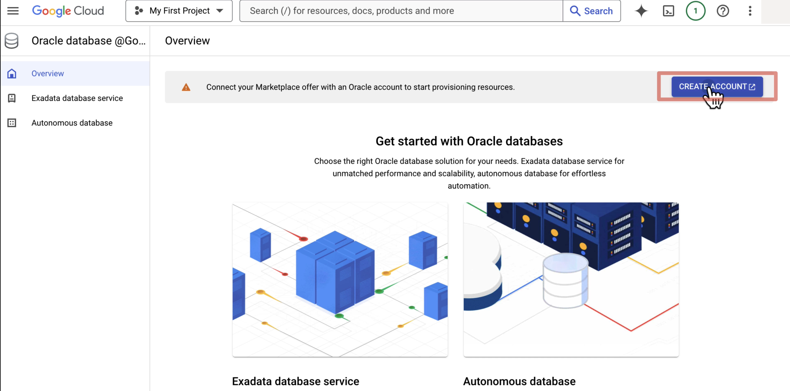
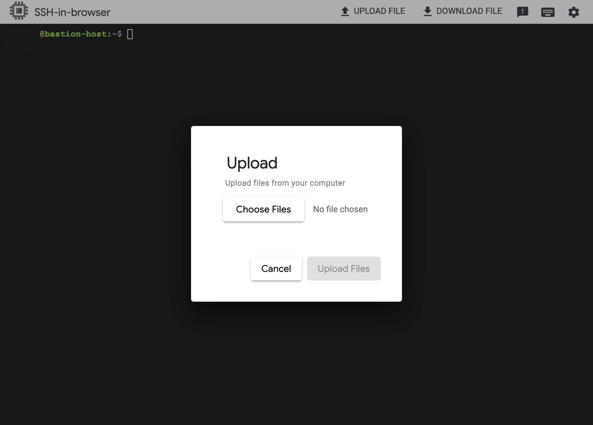
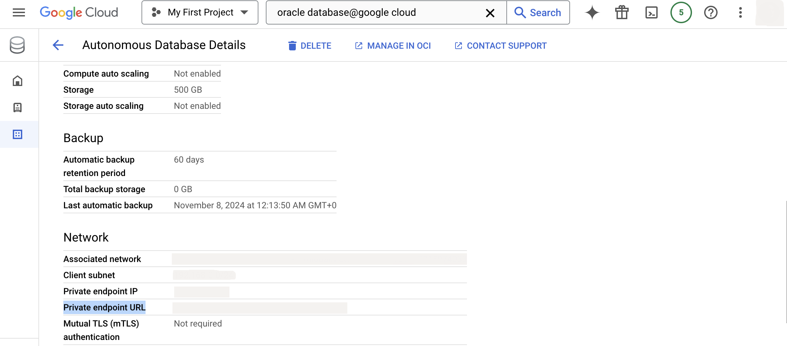
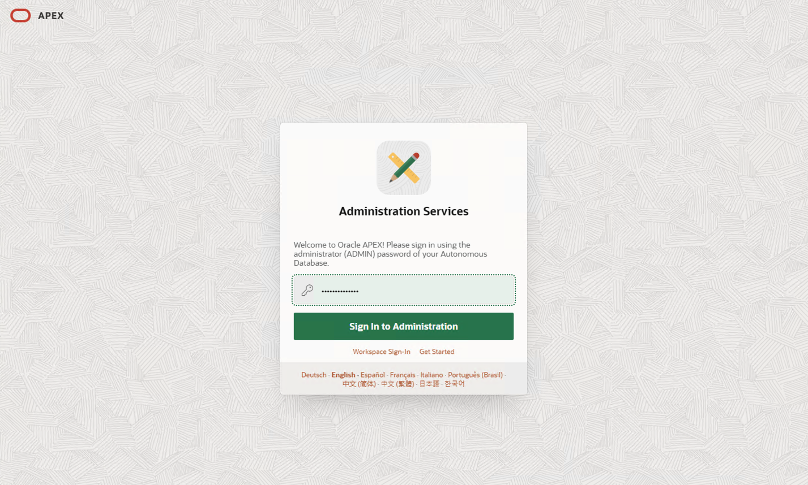
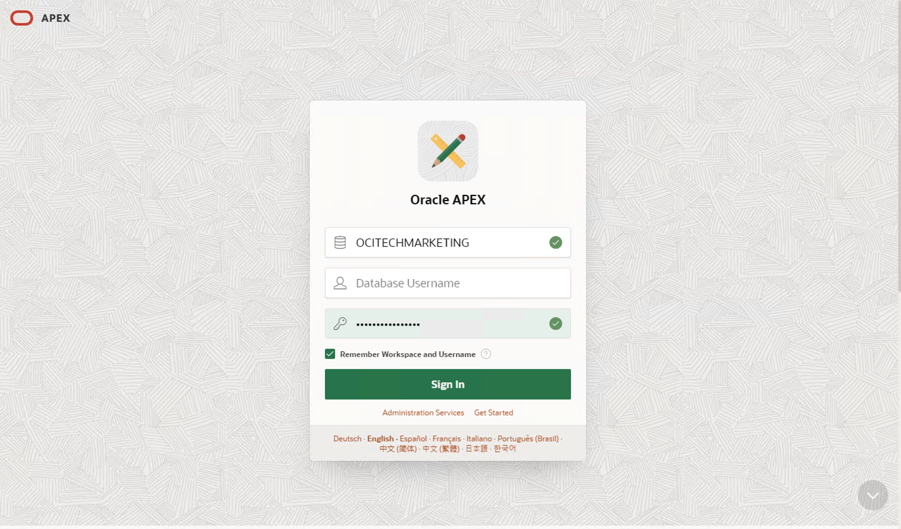

# Subscribe and deploy Oracle Database 23ai on Google Cloud Platform

## Prerequisites

Before we begin, make sure you have the following prerequisites:

- A GCP account with the necessary permissions to create resources
- A Bash shell installed on your system
- The gcloud command-line tool installed and configured on your system
- Oracle Autonomous Database at Google Cloud Platform(GCP) marketplace image

## How to

### Subscribe to Oracle Autonomous Database on GCP  

The first step in deploying an Oracle Autonomous Database on GCP is to subscribe to Oracle Database@Google Cloud image.

- Click search bar and type  `marketplace`
 

- In search bar type `oracle`
  

- Click on `subscribe`
  

- Once Image is activated click on `Manage on OCI`
  

- Connect Marketplace offer with an Oracle Account and click on `Create Account`
  

Once your account is approved you can deploy Oracle Autonomous Database on GCP.  

### Deploy Oracle Autonomous Database on GCP - terraform

Follow this guide on how to [deploy infrastructure with Terraform](/examples/adbs-minimal/README.md)  

### Connect to Oracle Database@Google Cloud

#### Connect to Oracle Database@Google Cloud via sqlcl running

- SSH to your VM

- Download and install [Oracle Instant Client](https://www.oracle.com/uk/database/technologies/instant-client/linux-x86-64-downloads.html)

```bash
wget https://download.oracle.com/otn_software/linux/instantclient/instantclient-basic-linux.x64-23.4.0.24.05.zip
sudo apt install zip
unzip instantclient-basic-linux.x64-23.4.0.24.05.zip
```

- Set the following environment variables to point to the extracted directory:

```bash
export ORACLE_HOME=/path/to/instantclient_23_4
export LD_LIBRARY_PATH=$ORACLE_HOME:$LD_LIBRARY_PATH
export PATH=$ORACLE_HOME:$PATH
```

Replace `/path/to/instantclient_23_4` with the actual path where you extracted the archive.

- Upload your wallet to the VM

  

- Unzip wallet by running

```bash
mkdir Wallet
unzip <YOUR WALLET NAME>.zip
```

- Export path to your wallet to TNS_ADMIN  

```bash
export TNS_ADMIN=<PATH TO UNZIPPED WALLET>
```

Replace `<PATH TO WALLET>` with the actual path where you extracted wallet zip.

- Install required packages

```bash
sudo apt-get install default-jdk libaio1 libaio-dev
```

- Download SQLCL - [here is official download page for SQLCL](https://www.oracle.com/database/sqldeveloper/technologies/sqlcl/download/)-

```bash
wget https://download.oracle.com/otn_software/java/sqldeveloper/sqlcl-latest.zip
```

- Unzip SQLCL

```bash
unzip sqlcl-24.3.0.285.0530.zip 
```

- Run SQLCL to connect to the Oracle Autonomous Database

```bash
./sqlcl/bin/sql admin/password@tnsname_medium
```

  

```sql
-- Create a table with a JSON column
CREATE TABLE mytable (
    id NUMBER PRIMARY KEY,
    data VARCHAR2(4000) CHECK (data IS JSON)
);

-- Insert some sample data
INSERT INTO mytable (id, data) VALUES (1, '{"name":"John", "age":30}');
INSERT INTO mytable (id, data) VALUES (2, '{"name":"Jane", "age":25}');

-- Query the JSON data using SQL/JSON functions
SELECT * FROM mytable WHERE JSON_VALUE(data, '$.name') = 'John';

-- Update the JSON data using JSON_OBJECT function
UPDATE mytable 
SET data = JSON_OBJECT('name' VALUE JSON_VALUE(data, '$.name'), 'age' VALUE 31) 
WHERE JSON_VALUE(data, '$.name') = 'John';
```

**Example 1:** Retrieve all rows where age is greater than 25

```sql
SELECT *
FROM mytable
WHERE JSON_VALUE(data, '$.age') > 25;
```

This query uses the JSON_VALUE function to extract the value of the age property from the data column and filters the results to include only rows where the age is greater than 25.

**Example 2:** Retrieve the average age of all users

```sql
SELECT AVG(JSON_VALUE(data, '$.age')) AS avg_age
FROM mytable;
```

This query uses the AVG aggregation function to calculate the average age of all users.

**Example 3:** Retrieve the names of all users who are older than 30

```sql
SELECT JSON_VALUE(data, '$.name') AS name
FROM mytable
WHERE JSON_VALUE(data, '$.age') > 30;
```

This query extracts the value of the name property from the data column and filters the results to include only rows where the age is greater than 30.

**Example 4:** Retrieve the count of users grouped by age range

```sql
SELECT 
  CASE 
    WHEN JSON_VALUE(data, '$.age') BETWEEN 20 AND 29 THEN '20-29'
    WHEN JSON_VALUE(data, '$.age') BETWEEN 30 AND 39 THEN '30-39'
    ELSE '40+'
  END AS age_range,
  COUNT(*) AS count
FROM mytable
GROUP BY 
  CASE 
    WHEN JSON_VALUE(data, '$.age') BETWEEN 20 AND 29 THEN '20-29'
    WHEN JSON_VALUE(data, '$.age') BETWEEN 30 AND 39 THEN '30-39'
    ELSE '40+'
  END;
```

#### (Optional) Connect to Oracle Database@Google Cloud APEX UI via Windows VM

- In `Compute Engine` section under `VM instances` you can access Windows VM.

  

- Click on `RDP` to download remote desktop file.  

- Open remote desktop file and login with your windows password.  

  

- Once logged in open browser on your remote `Windows VM` and navigate to Private endpoint URL

  

Then choose Oracle APEX

  

- Login with your admin password and create new `workspace`.

  

- Login to your `workspace`.

  

  

## Conclusion

In conclusion, deploying an Autonomous Database on GCP involves several steps, including creating a VPC, subnets, firewall rules, a bastion host or Windows VM, and configuring instaclient and sqlcl. By automating these steps using a Bash script, we can streamline the process and reduce the risk of human error. The script provides a flexible and modular approach to deploying an Autonomous Database on GCP, allowing us to customize and extend it as needed.

You may proceed to the next step [AI Chatbot engine with Oracle Database 23ai on Google Cloud](README_RAG.md)